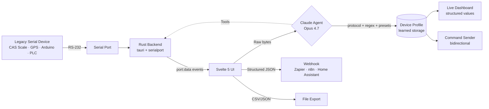

<div align="center">

# ⬡ OmniBridge

### **An AI agent category that didn't exist a year ago.**

OmniBridge identifies any legacy serial device protocol — binary, undocumented, proprietary — in under a minute. It is what industrial integration looks like once models can reason about raw bytes.


*Built for the Claude Opus 4.7 Hackathon 2026 · Problem Statement: **Build For What's Next***

<!-- Replace with real screenshot: 1400×800 capture of the app with Modbus investigation + live Dashboard + cost summary card visible -->
<!--  -->

</div>

---

## Why this exists

I work as a backend engineer on IoT systems, including industrial weighing scales (timbangan). I have shipped the kind of custom parser OmniBridge replaces — spent days reverse-engineering vendor protocols that didn't match their own documentation, written glue code nobody else will ever touch. The legacy-hardware integration tax is real and I have paid it.

When Opus 4.7 shipped with multi-turn tool use and adaptive extended thinking, I realized the shortcut I had wanted for years was finally buildable. So I built it.

This is **Build From What You Know** meeting **Build For What's Next**: a real problem I have lived, solved by a model capability class that emerged this year.

---

## ⚡ The Problem

Industrial floors, warehouses, labs, and maker workshops run on serial devices from the 1980s-2000s:
**weighing scales, GPS receivers, PLCs, Arduinos, lab instruments**. These devices speak proprietary
ASCII or binary protocols over RS-232 that take **weeks of developer time per device** to integrate:

- Decode the protocol manually (vendor docs missing or outdated)
- Write a custom parser
- Build glue code to forward data to modern systems (Slack, databases, cloud APIs)
- Repeat for every. single. device.

**OmniBridge replaces that week of work with 5 minutes of "plug in and let Claude figure it out".**

---

## 🧠 How It Works



### Core capabilities

1. **Protocol Detective** — Claude analyzes raw bytes → identifies protocol → generates per-field regex
2. **Live Dashboard** — real-time parsed values with sparkline charts (no API calls — regex runs locally)
3. **Device Profile Learning** — remembers each device by VID/PID → instant recognition on reconnect
4. **Agentic Investigation** — Claude uses tools (`read_more_lines`, `search_pattern`, `probe_baud`, `send_bytes`, `get_device_metadata`) to iteratively identify unknown devices
5. **Bidirectional Communication** — send commands to device with ASCII/HEX input, Claude-generated presets
6. **Cloud Bridge** — forward structured data to any webhook (Zapier, n8n, Home Assistant, custom)
7. **Export** — CSV/JSON download for offline analysis

---

## ✨ Features

<table>
<tr>
<td width="50%">

### 🧠 Protocol Detective
One-shot analysis or multi-step investigation. Claude identifies CAS scale, NMEA 0183, Modbus RTU, or custom protocols from raw serial bytes. Generates ECMAScript regex per field + `data_type` + `unit`.

</td>
<td width="50%">

### 📊 Live Structured Dashboard
After one analysis, parse thousands of incoming lines via regex — **zero API calls**. Sparkline charts for numeric fields, value flash animation, stale indicators, per-field timestamps.

</td>
</tr>
<tr>
<td width="50%">

### ⭐ Device Profile Learning
Every successful analysis (confidence ≥ 55%) is saved keyed by `VID:PID:SerialNumber`. Reconnect the same device → profile loads instantly, dashboard populates without a single API call.

</td>
<td width="50%">

### 🔬 Agentic Investigation
Claude uses **6 tools** to investigate unknown devices: read more lines, search ASCII patterns, **analyze binary structure** (CRC16 + frame detection), probe baud rates, send queries, lookup VID/PID. Live trace UI streams each step — thinking, tool call, tool result, final.

</td>
</tr>
<tr>
<td width="50%">

### → Bidirectional Communication
Send commands to devices with ASCII (with `\r \n \xNN` escapes) or HEX input. Claude-generated presets auto-populate — "Tare" for scales, "Set 1Hz" for GPS, Modbus queries for PLCs.

</td>
<td width="50%">

### 🔗 Cloud Bridge
Throttled webhook forwarding to any HTTP endpoint. Per-device config (URL, method, custom headers). Test connection before deploy. Payload includes parsed fields + units + timestamps.

</td>
</tr>
</table>

---

## 🚀 Quick Start

### Download

Pre-built DMG/installer: **[Releases page](../../releases/latest)** *(add your release URL after first release)*

Or build from source (below).

### First launch

1. Open OmniBridge → click **⚙ Settings** → paste your [Anthropic API key](https://console.anthropic.com)
2. Click **⊕ Discover Devices** to scan serial ports
3. Don't have hardware? Click **▶ Try Demo Mode** — virtual CAS Scale, GPS, and Arduino are always available
4. Pick a device → **▶ Monitor** → watch raw data stream
5. Click **⚡ Live** to auto-analyze, or **🔬 Investigate** for agentic multi-step discovery
6. Once identified, switch to **📊 Dashboard** tab to see parsed values
7. Click **🔗 Webhook** to forward data to Zapier/n8n/your-endpoint

### Build from source

Requires: [Rust](https://rustup.rs), [Node.js](https://nodejs.org) 20+, and [Tauri prerequisites](https://v2.tauri.app/start/prerequisites/).

```bash
git clone https://github.com/adindamochamad/omnibridge.git
cd omnibridge
npm install
npm run tauri dev
```

To build a distributable:

```bash
npm run tauri build
# Output: src-tauri/target/release/bundle/dmg/OmniBridge_0.1.0_x64.dmg (macOS)
#         src-tauri/target/release/bundle/msi/...                      (Windows)
#         src-tauri/target/release/bundle/appimage/...                 (Linux)
```

---

## 🎛 Demo Mode (no hardware needed)

OmniBridge ships with **four** virtual devices that emit realistic data streams — ideal for trying the app, recording demos, or stress-testing agentic investigation without hardware:

| Scenario | Protocol | Rate | Example output | Best for demo-ing |
|----------|----------|------|----------------|-------------------|
| ⚖️ CAS Weighing Scale | ASCII with stability flag | 4 Hz | `ST,GS,  1.234 kg\r\n` | One-shot `⚡ Live` analysis |
| 🛰️ GPS Receiver | NMEA 0183 | 1 Hz | `$GPGGA,123456.00,0612.48,S,10650.73,E,1,08,0.9,25.3,M...\r\n` | Checksum pattern verification |
| 🌡️ Arduino Sensor Array | key=value CSV | 2 Hz | `temp=24.5,humid=62.3,light=512\r\n` | Sparkline dashboard |
| 🏭 Modbus RTU PLC | **Binary** with CRC16 | 1.7 Hz | `01 03 14 00 FE 03 F5 00 2D 07 08 00 4B ... <CRC>` | **Agentic `🔬 Investigate`** — showcases Opus 4.7 |

Toggle via **▶ Try Demo Mode** in the sidebar.

---

## 🧱 Architecture

### Stack
- **Tauri 2** — cross-platform desktop shell (native WebView, Rust backend)
- **Rust + `serialport` 4.9** — direct port access, channel-based write, VID/PID classification
- **SvelteKit + Svelte 5** (runes mode) — reactive UI
- **Anthropic SDK + Claude Opus 4.7** — adaptive thinking, tool use, prompt caching
- **`@tauri-apps/plugin-store`** — persistent settings, device profiles, webhook configs

### Key files
```
src-tauri/src/
├── lib.rs              # Tauri commands, monitor thread, channel-based write
└── discovery.rs        # VID/PID device classification (Arduino, FTDI, CH340, CP210x)

src/lib/
├── claude.ts           # analyzeStream (one-shot) + analyzeWithAgent (multi-step)
├── agent-tools.ts      # 6 tool definitions + executor
├── parser.ts           # Regex-based stream parser (live dashboard)
├── profiles.ts         # Device profile CRUD (by VID:PID:Serial)
├── webhook.ts          # Webhook sender with throttle + custom headers
├── export.ts           # CSV/JSON export (structured + raw)
├── demo.ts             # 4 virtual device scenarios (incl. Modbus RTU binary)
└── *.svelte            # UI components: PortCard, DataBuffer, AnalysisPanel,
                        # AgentTracePanel, StructuredDashboard, Sparkline,
                        # CommandSender, WebhookConfigModal, SettingsModal
```

---

## 🧬 Why Opus 4.7 Specifically

OmniBridge is **not** a chatbot wrapper — every Opus 4.7 capability below maps to a concrete user-visible feature. Downgrade the model and the product breaks.

| Capability | How OmniBridge uses it | What would break without it |
|---|---|---|
| **Adaptive extended thinking** (`thinking: {type: "adaptive"}`) | Model spends more compute on Modbus RTU & unknown binary protocols, less on obvious NMEA/CSV | CAS scale would still work; Modbus CRC16 inference would regress to guesswork |
| **Multi-turn tool use** (6 tools, up to 8 iterations) | `analyze_binary_structure` → `read_more_lines` → `get_device_metadata` — Claude chains tools until confidence ≥ 80% | Single-shot analysis misses binary protocols entirely; no way to cross-reference VID/PID mid-reasoning |
| **Thinking preservation across tool results** (streaming `.finalMessage()`) | Each tool result is evaluated *with* the prior thinking still in context, so Claude builds on its own hypotheses instead of restarting | Tool calls would become independent shots; user sees "random" tool selection in the trace |
| **Prompt caching** (`cache_control: ephemeral` on system prompt) | 70% cheaper after the first call — investigation cost drops from $0.15 to ~$0.05 | Every analyze-live retrigger would cost full price; Live Mode becomes economically unviable |
| **1M-token context window** | Full 1000-line buffer + VID/PID metadata + all 6 tool definitions fit in a single request | Would need to truncate buffer aggressively, losing rare packet types that only appear once per 500 lines |

### The investigation loop in detail

```
User clicks 🔬 Investigate on Modbus PLC
  ↓
[Claude, interleaved reasoning]
  "printable_ratio probably low — start with binary analysis"
  ↓
[tool: analyze_binary_structure]
  → returns: printable_ratio=0.12, frame_length=25,
             modbus_crc_check.validity_ratio=1.0
  ↓
[Claude, now confident]
  "All 18 frames pass CRC16-IBM. This is Modbus RTU."
  ↓
[tool: get_device_metadata]
  → returns: Schneider Electric · Modicon M221
  ↓
[Final JSON]
  protocol: "Modbus RTU"
  confidence: 98
  fields: [temp, pressure, flow, motor_rpm, valve_pct, alarm_bits]
```

**That whole flow is ~20 seconds, 3 API calls, and ~$0.04 in tokens.** A human engineer doing the same task from scratch typically takes 2–4 hours with a Modbus RTU reference manual open.

---

## 🎨 Interaction Model

### One-shot vs agentic analysis
- **⬡ Analyze** — single API call, fast (~5 sec). Good for straightforward ASCII protocols.
- **🔬 Investigate** — multi-step agent with tools, slower (~15-30 sec). Best for unknown or binary protocols.

### Live mode auto-trigger
- **⚡ Live** toggle auto-analyzes as data accumulates
- Thresholds: 10 lines → first trigger, 15 lines → retry, 25 lines → force-fire
- Debounce: 400ms (works for 1Hz GPS up to 100Hz Modbus)

### Cost-conscious defaults
- Claude API is called **only on Analyze / Investigate / Live** — not for live dashboard updates
- Once a device is learned, reopening loads from local store with zero API calls
- All regex parsing, sparklines, webhook forwarding = free after initial identification

---

## 🗺 Roadmap

- [x] Discovery + VID/PID classification
- [x] Protocol Detective (one-shot + agentic)
- [x] Live structured dashboard with regex parsing
- [x] Device profile learning
- [x] Auto baud rate probing
- [x] Bidirectional communication
- [x] Webhook forwarding
- [x] CSV/JSON export
- [x] Demo mode with 3 virtual devices
- [ ] Modbus RTU + other binary protocol showcases
- [ ] Chat panel — natural language Q&A over buffer
- [ ] Multi-device correlation dashboards
- [ ] MCP server mode (expose devices as tools to other agents)
- [ ] Windows signing + auto-updater
- [ ] Session replay (time-travel debugging)

---

## 🤝 Contributing

Bug reports, protocol examples, and device profile contributions welcome. Open an issue or PR.

If you test OmniBridge with real hardware (scales, GPS modules, PLCs, sensors), please:
1. Share the VID/PID + manufacturer string
2. Share a short capture (first 50 lines, stripped of any sensitive data)
3. Mention the model in an issue so we can validate the protocol detection

---

## 📜 License

MIT — see [LICENSE](./LICENSE)

---

<div align="center">

**⬡ OmniBridge** — *legacy hardware, first-class citizens*

Made with ◇ Tauri, ◉ Svelte, ⚙ Rust, and 🧠 Claude

</div>
